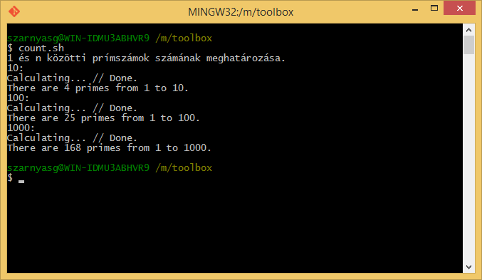

## Bash szkript futtatása

A prímszámos alkalmazásunkhoz egy kollégánk készített egy Bash szkriptet, ami különböző bemenetekre lefuttatja a programot. Kollégánk nem járatos a Linux alkalmazásában, ezért a szkriptet Windows alatt, MinGW környezetben írta és tesztelte.



Töltsük le és futtassuk a szkriptet.

```bash
$ wget http://docs.inf.mit.bme.hu/toolbox/count.zip
$ unzip count.zip
$ ./count.sh
bash: ./count.sh: Permission denied
```

Hibaüzenetet kaptunk: nincs engedélyünk futtatni a programot. Nézzük meg, milyen pontosan jogosultságokkal rendelkezik a `count.sh` fájl!

```bash
$ ls -l count.sh
-rw-rw-rw- 1 szarnyasg szarnyasg 115 Jun  4 08:58 count.sh
```

Tegyük futtathatóvá a fájlt és futtassuk újra.

```bash
$ chmod +x count.sh
$ ls -l count.sh
-rwxrwxrwx 1 szarnyasg szarnyasg 115 Jun  4 08:58 count.sh
$ ./count.sh
bash: ./count.sh: /bin/bash^M: bad interpreter: No such file or directory
```

A rendszer elkezdi futtatni, de ismét hibaüzenetet kaptunk. Korábban említettük, hogy a `^M` a _carriage return_ karakterhez tartozik. A `file` eszköz használatával nézzünk rá a fájl adataira.

```bash
$ file count.sh
count.sh: Bourne-Again shell script, ISO-8859 text executable, with CRLF line terminators
```

Több dolog is kiderül a fájról:

* Bash szkript.
* ISO-8859 karakterkódolású szöveges futtatható állomány.
* `CRLF` sorvégeket használ.

A mostani hibaüzentet azért kaptuk, mert a fájl a windowsban használt `CRLF` sorvégeket használja a Linuxban használt `LF` sorvégek helyett. Ezt javíthatjuk egy fejlettebb szövegszerkesztővel vagy parancssorból a `dos2unix` eszközzel. Telepítsük ezt az eszközt.

```bash
$ sudo apt-get install dos2unix
$ dos2unix count.sh
dos2unix: converting file count.sh to Unix format ...
$ ./count.sh
```

A program lefut, de az ékezetes karakterek rosszul jelennek meg. Ennek oka, hogy a fájl olyan karakterkódolással készült, amit nem támogat a Bash. Különböző karakterkódolások közötti konverziót az az `iconv` eszközzel végezhetünk. Az elérhető karakterkódolások listáját az `iconv --list` paranccsal kaphatjuk meg.

```bash
$ iconv -f ISO8859-2 -t UTF-8 count.sh
```

A parancs helyes karakterkódolással kiírja a szkriptet, de nem perzisztálja azt, ezért egy fájlba kell irányítanunk.

```bash
$ iconv -f ISO8859-2 -t UTF-8 count.sh > count-utf8.sh
```

**Megjegyzés:** az `ISO8859-2` kódlap mellett itt működnének a `latin2`, `CP1250` és a `CP1252` kódlapok is.

Nevezzük át a `count-utf8.sh` fájlt `count.sh`-ra, ezzel felülírva az eredeti fájlt.

```bash
$ mv count-utf8.sh count.sh
$ chmod +x count.sh
```

**Megjegyzés:** sok Unix eszközhöz hasonlóan az `iconv` is adatfolyamokban gondolkodik, és nem támogat "in place" műveleteket, azaz nem tudjuk vele a fájlt egy lépésben átkonverálni és felülírni.

Futtassuk újra!

```
$ ./count.sh
1 és n közötti prímszámok számának meghatározása.
10:
./count.sh: line 7: primes: command not found
100:
./count.sh: line 7: primes: command not found
1000:
./count.sh: line 7: primes: command not found
```

Míg Windows alatt a PATH része az aktuális könyvtár, Linuxon nem az -- javítanunk kell tehát a primes alkalmazás hívását.

```bash
$ nano count.sh
```

A `nano` szövegszerkesztőből `^X` karakterrel \(`Ctrl`+`X` billentyűkombináció\) léphetünk ki. Kilépés nélkül is elmenthetjük a munkánkat a `^O` karakterrel.

```
$ ./count.sh
1 és n közötti prímszámok számának meghatározása.
10:
run-detectors: unable to find an interpreter for ./primes
100:
run-detectors: unable to find an interpreter for ./primes
1000:
run-detectors: unable to find an interpreter for ./primes
```

A Windows alatt fordított `.exe` bináris állomány nem fog működni Linux alatt, ezért újra kell fordítanunk. Ezt szerencsére könnyen megtehetjük a Makefile segítségével:

```bash
$ make
```

Ezután már megfelelően fog működni a programunk.

```bash
$ ./count.sh
1 és n közötti prímszámok számának meghatározása.
10:
Calculating... // Done.
There are 4 primes from 1 to 10.
100:
Calculating... // Done.
There are 25 primes from 1 to 100.
1000:
Calculating... // Done.
There are 168 primes from 1 to 1000.
```

